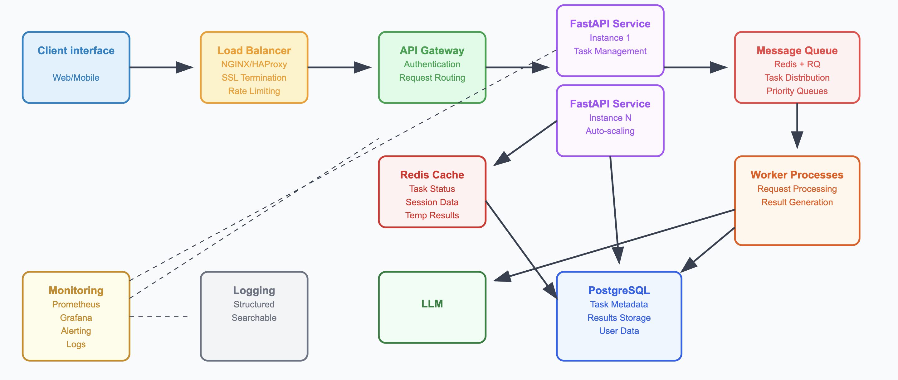

# Asynchronous Task Processing API Design Document

## Executive Summary

This document presents a comprehensive design for an asynchronous task processing API that accepts text processing tasks, processes them asynchronously, and provides status tracking and result any API's . The system is designed to be scalable, reliable, and extensible for future complex tasks like LLM integration or complex databases.

## 1. Overall Architecture

### High-Level Architecture



### Component Breakdown

1. **API Gateway/Load Balancer**: Routes requests and provides SSL termination
2. **FastAPI Service**: Handles HTTP requests and manages task lifecycle
3. **Message Queue (Redis + RQ)**: Manages asynchronous task distribution
4. **Worker Processes**: Execute text processing tasks
5. **PostgreSQL Database**: Persistent storage for task metadata and results
6. **Redis Cache**: Fast access to task status and temporary data

### Architectural Rationale

- **Separation of Concerns**: API layer handles HTTP, workers handle processing
- **Horizontal Scalability**: Independent scaling of API servers and workers
- **Fault Tolerance**: Message queue ensures task persistence across restarts
- **Performance**: Redis cache provides fast status checks without database queries
- **Reliability**: PostgreSQL ensures data durability and ACID compliance

## 2. API Design

### Submit a Task

**Endpoint**: `POST /api/v1/tasks`

**Request Payload**:
```json
{
  "text": "text content here...",
  "options": {
    "include_stopwords": false,
    "word_count_threshold": 5
  }
}
```

**Response** (HTTP 202 Accepted):
```json
{
  "task_id": "uuid-format-task-id",
  "status": "PENDING",
  "created_at": "2025-01-15T10:30:00Z",
  "estimated_completion": "2025-01-15T10:30:15Z",
  "result_url": "/api/v1/tasks/uuid-format-task-id"
}
```

**Task ID Generation**: 
- Use UUID4 for guaranteed uniqueness
- Include timestamp prefix for easier debugging: `20250115_uuid4()`
- Store in database with unique constraint

### Check Task Status & Results

**Endpoint**: `GET /api/v1/tasks/{task_id}`

**Response Examples**:

*Pending/Processing*:
```json
{
  "task_id": "uuid-format-task-id",
  "status": "PROCESSING",
  "created_at": "2025-01-15T10:30:00Z",
  "started_at": "2025-01-15T10:30:02Z",
  "progress": 0.6,
  "estimated_completion": "2025-01-15T10:30:12Z"
}
```

*Completed*:
```json
{
  "task_id": "uuid-4-format-task-id",
  "status": "COMPLETED",
  "created_at": "2025-01-15T10:30:00Z",
  "completed_at": "2025-01-15T10:30:08Z",
  "result": {
    "word_count": 1250,
    "most_frequent_words": [
      {"word": "analysis", "count": 15},
      {"word": "system", "count": 12},
      {"word": "design", "count": 10},
      {"word": "architecture", "count": 8},
      {"word": "scalable", "count": 7}
    ],
    "processing_time_ms": 8240
  }
}
```

*Failed*:
```json
{
  "task_id": "uuid-format-task-id",
  "status": "FAILED",
  "created_at": "2025-01-15T10:30:00Z",
  "failed_at": "2025-01-15T10:30:05Z",
  "error": {
    "code": "PROCESSING_ERROR",
    "message": "Text processing failed due to invalid encoding"
  }
}
```

**Non-existent Task ID**: HTTP 404 with error message indicating task not found.

### List Tasks

**Endpoint**: `GET /api/v1/tasks`

**Query Parameters**:
- `status`: Filter by status (PENDING, PROCESSING, COMPLETED, FAILED)
- `page`: Page number (default: 1)
- `limit`: Items per page (default: 20, max: 100)
- `sort`: Sort order (created_at_desc, created_at_asc)

**Response**:
```json
{
  "tasks": [
    {
      "task_id": "f47ac10b-58cc-4372-a567-0e02b2c3d479",
      "status": "COMPLETED",
      "created_at": "2024-01-15T10:30:00Z",
      "completed_at": "2024-01-15T10:30:08Z"
    },
    {
      "task_id": "9a18cb32-3e2d-4c4e-8fbd-72e99e4dbb97",
      "status": "FAILED",
      "created_at": "2024-01-15T10:25:00Z",
      "completed_at": null
    }
  ],
  "pagination": {
    "page": 1,
    "limit": 20,
    "total": 156,
    "total_pages": 8
  }
}

```

## 3. Asynchronous Task Processing

### Technology Choice: Redis + RQ (Redis Queue)

**Selection Rationale**:
- **RQ**: Python-native, simple to implement and debug
- **Redis**: Reliable, fast, excellent Python ecosystem support
- **Alternatives Considered**:
  - Celery: More complex, overkill for this use case
  - AWS SQS: Vendor lock-in, additional latency
  - RabbitMQ: More complex setup, higher resource usage

### Task Processing Mechanism

```python
# Task definition
@job('default', connection=redis_conn, timeout=300)
def process_text_task(task_id: str, text: str, options: dict):
    try:
        # Update status to PROCESSING
        update_task_status(task_id, 'PROCESSING')
        
        # Simulate processing delay
        time.sleep(random.uniform(5, 10))
        
        # Perform text analysis
        result = analyze_text(text, options)
        
        # Store result and update status
        store_task_result(task_id, result)
        update_task_status(task_id, 'COMPLETED')
        
        return result
    except Exception as e:
        update_task_status(task_id, 'FAILED', error=str(e))
        raise
```

### Addressing Key Concerns

#### 1. Idempotency
- **Database Constraints**: Unique constraint on task_id prevents duplicate submissions
- **Idempotent Operations**: All status updates use upsert operations
- **Result Caching**: Once completed, results are immutable

#### 2. Retries
- **Automatic Retries**: RQ supports automatic retries with exponential backoff
- **Configuration**: Max 3 retries, 1s, 4s, 16s delays
- **Dead Letter Queue**: Failed tasks after max retries go to failed queue

#### 3. Race Conditions
- **Database Transactions**: Status updates within database transactions
- **Atomic Operations**: Redis operations for cache updates are atomic
- **Optimistic Locking**: Version numbers on task records
- **Worker Deduplication**: RQ ensures only one worker processes each job

### Task Lifecycle Management

```python
class TaskStatus(Enum):
    PENDING = "PENDING"
    PROCESSING = "PROCESSING"
    COMPLETED = "COMPLETED"
    FAILED = "FAILED"
    CANCELLED = "CANCELLED"

# State transitions
VALID_TRANSITIONS = {
    TaskStatus.PENDING: [TaskStatus.PROCESSING, TaskStatus.CANCELLED],
    TaskStatus.PROCESSING: [TaskStatus.COMPLETED, TaskStatus.FAILED],
    TaskStatus.COMPLETED: [],  # Terminal state
    TaskStatus.FAILED: [TaskStatus.PENDING],  # Allow retry
    TaskStatus.CANCELLED: []   # Terminal state
}
```

### Text Processing Implementation

```python
def analyze_text(text: str, options: dict) -> dict:
    # Simulate processing delay
    time.sleep(random.uniform(5, 10))
    
    # Word count
    word_count = len(text.split())
    
    # Most frequent words (excluding stopwords)
    words = re.findall(r'\b\w+\b', text.lower())
    if not options.get('include_stopwords', False):
        words = [w for w in words if w not in STOP_WORDS]
    
    word_freq = Counter(words)
    most_frequent = word_freq.most_common(5)
    
    return {
        'word_count': word_count,
        'most_frequent_words': [
            {'word': word, 'count': count} 
            for word, count in most_frequent
        ],
        'processing_time_ms': int(time.time() * 1000)
    }
```

### Error Handling During Processing

```python
def process_text_with_error_handling(task_id: str, text: str, options: dict):
    try:
        # Validation
        if not text.strip():
            raise ValueError("Empty text provided")
        
        if len(text) > 1_000_000:  # 1MB limit
            raise ValueError("Text too large")
        
        # Process
        result = analyze_text(text, options)
        return result
        
    except UnicodeDecodeError:
        raise ProcessingError("Invalid text encoding")
    except MemoryError:
        raise ProcessingError("Text too large to process")
    except Exception as e:
        logger.error(f"Unexpected error processing task {task_id}: {e}")
        raise ProcessingError(f"Processing failed: {str(e)}")
```

### LLM API Integration Considerations

If integrating with external LLM APIs:

1. **Rate Limiting**: Implement token bucket or sliding window
2. **API Key Management**: Use environment variables or secret management
3. **Timeout Handling**: Set appropriate timeouts (30-60 seconds)
4. **Error Handling**: Distinguish between retryable and non-retryable errors
5. **Cost Tracking**: Monitor API usage and costs
6. **Fallback Strategies**: Implement graceful degradation

```python
@retry(
    stop=stop_after_attempt(3),
    wait=wait_exponential(multiplier=1, min=4, max=10),
    retry=retry_if_exception_type((RequestException, TimeoutError))
)
def call_llm_api(text: str) -> str:
    response = requests.post(
        "https://api.openai.com/v1/completions",
        headers={"Authorization": f"Bearer {API_KEY}"},
        json={"model": "gpt-3.5-turbo", "prompt": text},
        timeout=30
    )
    response.raise_for_status()
    return response.json()["choices"][0]["text"]
```

## 4. Data Persistence

### Database Schema

**PostgreSQL Schema**:

```sql
-- Tasks table
CREATE TABLE tasks (
    id UUID PRIMARY KEY DEFAULT gen_random_uuid(),
    status VARCHAR(20) NOT NULL CHECK (status IN ('PENDING', 'PROCESSING', 'COMPLETED', 'FAILED', 'CANCELLED')),
    text TEXT NOT NULL,
    options JSONB DEFAULT '{}',
    result JSONB,
    error_message TEXT,
    created_at TIMESTAMP WITH TIME ZONE DEFAULT NOW(),
    started_at TIMESTAMP WITH TIME ZONE,
    completed_at TIMESTAMP WITH TIME ZONE,
    retry_count INTEGER DEFAULT 0,
    version INTEGER DEFAULT 1
);

-- Indexes
CREATE INDEX idx_tasks_status ON tasks(status);
CREATE INDEX idx_tasks_created_at ON tasks(created_at);
CREATE INDEX idx_tasks_status_created ON tasks(status, created_at);

-- Task audit log
CREATE TABLE task_audit_log (
    id SERIAL PRIMARY KEY,
    task_id UUID NOT NULL REFERENCES tasks(id),
    old_status VARCHAR(20),
    new_status VARCHAR(20),
    changed_at TIMESTAMP WITH TIME ZONE DEFAULT NOW(),
    changed_by VARCHAR(100)
);
```

### Database Choice Justification

#### For This Assignment: PostgreSQL
- **ACID Compliance**: Ensures data consistency
- **JSON Support**: JSON for flexible options and results storage
- **Rich Indexing**: Supports complex queries and filtering
- **Python Integration**: Excellent SQLAlchemy support

#### For High Throughput Production: Hybrid Approach
- **PostgreSQL**: Primary storage for task metadata and results
- **Redis**: Cache layer for frequently accessed data
- **Time-series DB**: For metrics and analytics (InfluxDB/TimescaleDB)

**Trade-offs**:
- **PostgreSQL Pros**: ACID, complex queries, mature ecosystem
- **PostgreSQL Cons**: Vertical scaling limits, higher latency for simple reads
- **NoSQL Pros**: Horizontal scaling, flexible schema, higher throughput
- **NoSQL Cons**: Eventual consistency, limited query capabilities

## 5. Technology Stack

#### Primary Stack (Python)


### Framework Choice: FastAPI

**Justification**:
- **Performance**: Async/await support, comparable to NodeJS
- **Type Safety**: Pydantic integration for request/response validation
- **Documentation**: Automatic OpenAPI/Swagger generation
- **Modern**: Python 3.8+ features, excellent developer experience

### Migration to More Performant Language

**Choice: Go**

**Rationale**:
- **Performance**: 10-100x faster than Python for CPU-intensive tasks
- **Concurrency**: Goroutines provide excellent concurrent processing
- **Deployment**: Single binary, minimal resource usage
- **Ecosystem**: Rich standard library, excellent HTTP and database support

**When to Consider**:
- High-frequency task processing (>10,000 tasks/minute)
- CPU-intensive text processing operations
- Memory-constrained environments
- Microsecond-level latency requirements

## 6. Scalability and Reliability

### Horizontal Scaling Strategy

#### Worker Scaling
- **Auto-scaling**: Scale workers based on queue depth
- **Node Affinity**: Distribute workers across availability zones
- **Resource Limits**: Prevent resource exhaustion


#### Database Scaling
- **Read Replicas**: Distribute read queries across replicas
- **Partitioning**: Partition tasks table by created_at for better performance

### Reliability Measures

#### Worker Crash Recovery
- Heartbeat Mechanism: Each worker periodically sends a heartbeat to Redis (e.g., every 10 seconds). If a worker fails to send heartbeats within a threshold (e.g., 30 seconds), it is considered dead.

- Orphaned Task Detection: A background process or scheduled job regularly scans the tasks table for jobs stuck in PROCESSING state beyond a reasonable timeout (e.g., 5 minutes).

- Automatic Requeue: Detected orphaned tasks are marked as PENDING, and the retry_count is incremented. These tasks are then re-enqueued into the Redis queue for re-processing.

- Worker TTL: RQ supports --worker-ttl to detect stale worker processes and clean up zombies proactively.

#### Dead Letter Queue
To prevent endlessly retrying failing tasks and allow for post-mortem analysis:

- Max Retry Limit: Each task has a retry_count field. If a task fails more than the allowed number of retries (e.g., 3 attempts), it's moved to the Dead Letter Queue (DLQ).

- DLQ Queue in Redis: A separate RQ queue named failed (or dead_letter) is used to capture these tasks.

- Database Flag: Tasks moved to the DLQ are updated in the database with status FAILED and include detailed error logs.

- Alerting & Metrics: Each addition to the DLQ increments a Prometheus counter. Alerts can be configured when this exceeds a threshold.

## 7. Containerization & Deployment

### Docker Strategy

**Key Dockerfile Concerns**:
- **Multi-stage Build**: Separate build and runtime stages
- **Security**: Non-root user, minimal base image
- **Optimization**: Layer caching, dependency optimization
- **Health Checks**: Container health monitoring


### Deployment Strategy

**Cloud Provider: AWS**
- **Container Orchestration**: Amazon EKS (Kubernetes)
- **Load Balancing**: Application Load Balancer
- **Database**: Amazon RDS PostgreSQL with Multi-AZ
- **Cache**: Amazon ElastiCache (Redis)
- **Monitoring**: CloudWatch + Prometheus

**Deployment Pipeline**:
1. **CI/CD**: GitHub Actions or AWS CodePipeline
2. **Testing**: Automated testing in staging environment
3. **Blue-Green Deployment**: Zero-downtime deployments
4. **Rollback Strategy**: Automatic rollback on health check failures

## 8. Testing Strategy

### Testing Pyramid
The testing strategy follows a testing pyramid model prioritizing fast, isolated unit tests at the base, supplemented by integration tests, and topped with a smaller number of full end-to-end tests. The goals are:

- Ensure correctness of individual components (functions, classes)

- Validate interactions between components (DB, queue, API)

- Catch regressions early and cheaply

- Test real-world behavior with minimal overhead

#### Unit Tests (70%)
- Fast, easy to run in CL; ensures logic like text analysis, task creation, error handling is solid.

#### Integration Tests (20%)
- Validates interaction with Redis, RQ, PostgreSQL key in async architecture.

#### End-to-End Tests (10%)
- Simulates actual user flows (submit task → get result); ensures system correctness.
#### Load Tests	
- Useful for production readiness and queue scaling, but not required for each PR

### Critical Testing Areas

1. **API Endpoints**: Request/response validation, error handling
2. **Task Processing**: Text analysis accuracy, error scenarios
3. **Database Operations**: Data integrity, concurrent access
4. **Queue Operations**: Job enqueueing, processing, failure handling
5. **Scalability**: Load testing with increasing concurrent users
6. **Security**: Authentication, input validation, SQL injection prevention


## 9. Production Considerations

### Monitoring and Logging

#### Metrics Collection

#### Structured Logging


#### Key Monitoring Metrics
- **Application Metrics**: Request rate, response time, error rate
- **Queue Metrics**: Queue depth, processing rate, failed jobs
- **Database Metrics**: Connection pool usage, query performance
- **System Metrics**: CPU, memory, disk usage


## Conclusion

This design provides a robust, scalable foundation for asynchronous task processing with clear extensibility paths for future enhancements. The architecture balances simplicity with production-readiness, ensuring reliable
